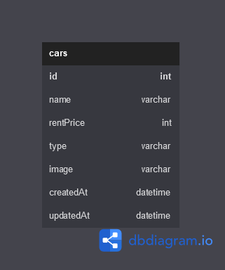

# challenge-05

### Installation

1. Clone the repo
   ```sh
   git clone https://github.com/adiprrassetyo/Chapter-5.git
   ```
2. Install packages
   ```sh
   npm install
   ```
3. Next Step

   ```sh
   - setting config.js with your database, in my case i use xampp/mysql
   - npx sequelize db:create
   - npx sequelize db:migrate
   ```

4. Run
   ```sh
   npm start
# ERD


1. Halaman Index (GET) = http://localhost:3000/
2. Halaman Edit Car (POST) = http://localhost:3000/cars/update/:id
3. Halaman Create Car (POST) = http://localhost:3000/cars/create
4. Delete (GET) = http://localhost:3000/cars/delete/:id
